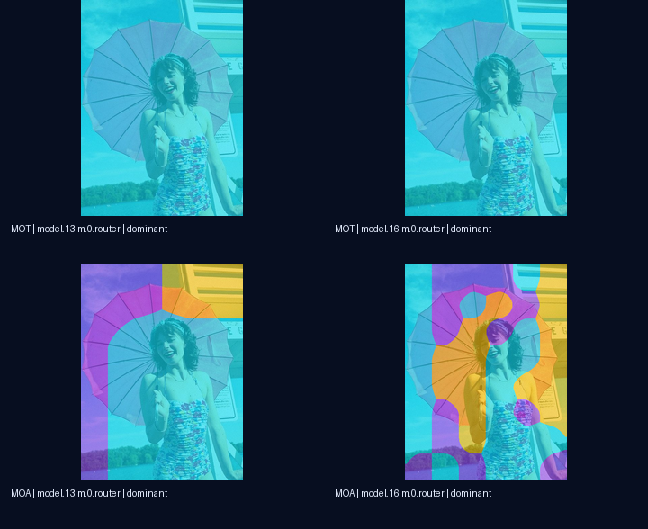

# YOLO-Master E3 P2 · Spatial Routing Lens

> **P2 status: PASS** · five-family feasibility audit · true MoT/MoA token overlays · reproducible local demo



This repository implements the P2 deliverable for E3: map real token/spatial routing tensors back to the
original image, provide a demo that can be explained in two minutes, and extend the audit beyond the three P0
families. It deliberately refuses to turn sample-level vectors into visually plausible but semantically false
heatmaps.

## Result at a glance

| Family | Runtime evidence | Token overlay | Decision |
| --- | --- | --- | --- |
| MoT | Four full-detector routers emit `[B,3,H,W]` | Yes | `SUPPORTED` |
| MoA | Four full-detector routers emit `[B,3,H,W]` | Yes | `SUPPORTED` |
| MoE | Twelve nested routers emit `[B,2]` Top-K decisions | No | explicit `UNSUPPORTED` |
| Latent | Three modules emit `[B,4]` on the expert axis | No | explicit `UNSUPPORTED` |
| MoLoRA | Linear/spatial/hybrid routers all emit `[B,4]` | No | explicit `UNSUPPORTED` |

The strengthened CPU run used all four `coco8` validation images. It produced 32 true spatial captures, 144 raw
arrays and 192 switchable demo views. MoT and MoA passed exact repeated-capture comparison; registered hooks
changed model output by a maximum absolute value of `0`. Single-image capture was also compared against batch
sizes 2 and 4: probability differences were `0`, MoT indices were identical, and the largest logit difference was
`1.24e-10`.

## Reproduce

Place this repository beside the pinned YOLO-Master source directory and the existing project-local environment:

```text
workdir/
├── YOLO-Master-E3-P2/
├── YOLO-Master-main-07d3303/
└── YOLO-Master-baseline/.venv/
```

From Windows CMD:

```bat
cd /d C:\path\to\YOLO-Master-E3-P2
run_tests.cmd
run_p2.cmd --run-id my-p2-run
run_demo.cmd
```

`run_p2.cmd` fails closed if the nine pinned upstream files differ, the implementation files are not committed,
probabilities are invalid, a spatial axis collapses, Top-K indices disagree with MoT sparse weights, repeated or
single-versus-batch captures differ, demo assets lose their original-image dimensions, hooks leak, or the hooked
model output changes.

## Evidence map

- [`summary.json`](artifacts/p2/p2-20260904-cpu-batch-diagnostics-v4/summary.json): machine-readable verdict and coverage.
- [`family-feasibility.json`](artifacts/p2/p2-20260904-cpu-batch-diagnostics-v4/family-feasibility.json): five-family runtime decision record.
- [`spatial-routing-raw.npz`](artifacts/p2/p2-20260904-cpu-batch-diagnostics-v4/spatial-routing-raw.npz): raw probabilities, logits, derived fields and MoT indices.
- [`spatial-captures.json`](artifacts/p2/p2-20260904-cpu-batch-diagnostics-v4/spatial-captures.json): array keys, shapes and per-capture validation.
- [`spatial-diagnostics.json`](artifacts/p2/p2-20260904-cpu-batch-diagnostics-v4/spatial-diagnostics.json): entropy, margin, dominant load and neighboring-token variation.
- [`demo.html`](artifacts/p2/p2-20260904-cpu-batch-diagnostics-v4/demo.html): paired original/overlay viewer and evidence export.
- [`demo-smoke.json`](artifacts/p2/p2-20260904-cpu-batch-diagnostics-v4/demo-smoke.json): desktop/mobile rendered-browser validation.
- [`manifest.sha256.json`](artifacts/p2/p2-20260904-cpu-batch-diagnostics-v4/manifest.sha256.json): byte length and SHA-256 for every evidence file.

Design, feasibility reasoning, experiment interpretation and the two-minute flow are documented in [`docs/`](docs/).

## Interpretation boundary

The models are randomly initialized because no compatible trained MoT/MoA checkpoint is available in the local
project. Therefore these results prove capture correctness, coordinate mapping, repeatability and demo behavior;
they do **not** prove learned expert specialization or task accuracy. Raw probabilities use a fixed `[0,1]` color
scale. Entropy and Top-1 margin also retain their absolute `[0,1]` semantics, and the UI states the limitation next
to every visualization workflow.
