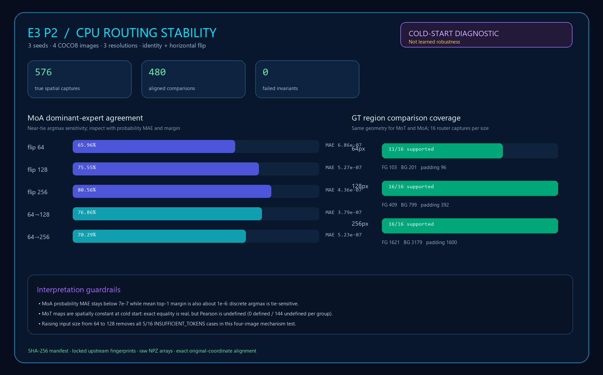
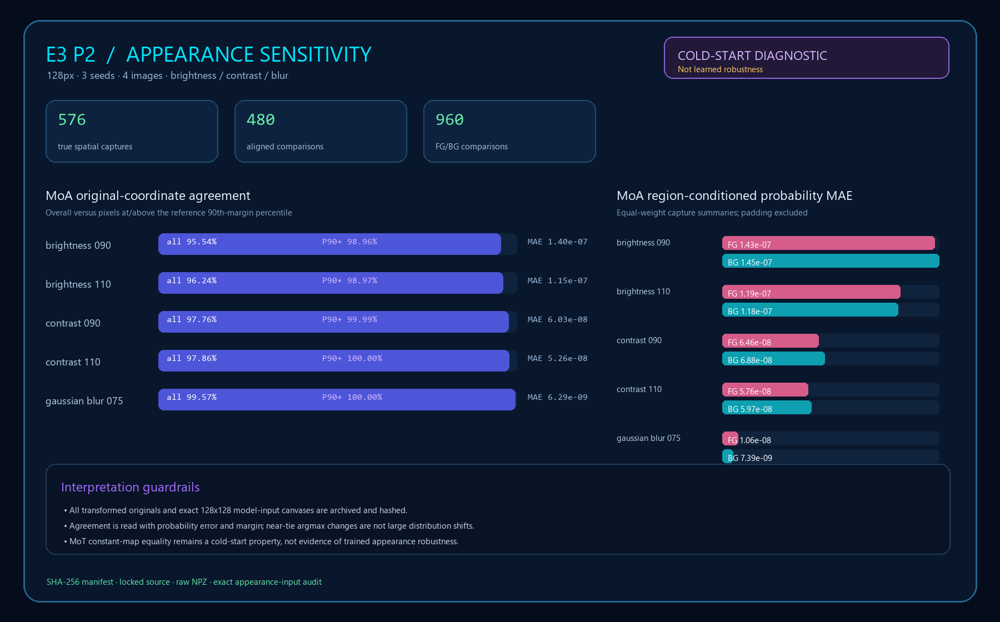
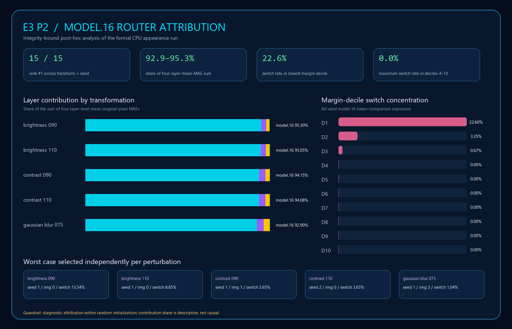

# YOLO-Master E3 P2 · Spatial Routing Lens

> **P2 status: PASS** · five-family feasibility audit · true MoT/MoA token overlays · ground-truth region analysis · CPU perturbation diagnostics · layer attribution · reproducible local demo








This repository implements the P2 deliverable for E3: map real token/spatial routing tensors back to the
original image, provide a demo that can be explained in two minutes, and extend the audit beyond the three P0
families. It deliberately refuses to turn sample-level vectors into visually plausible but semantically false
heatmaps.

## Result at a glance

| Family | Runtime evidence | Token overlay | Decision |
| --- | --- | --- | --- |
| MoT | Four full-detector routers emit `[B,3,H,W]` | Yes | `SUPPORTED` |
| MoA | Four full-detector routers emit `[B,3,H,W]` | Yes | `SUPPORTED` |
| MoE | Twelve nested routers emit `[B,2]` Top-K decisions | No | explicit `UNSUPPORTED` |
| Latent | Three modules emit `[B,4]` on the expert axis | No | explicit `UNSUPPORTED` |
| MoLoRA | Linear/spatial/hybrid routers all emit `[B,4]` | No | explicit `UNSUPPORTED` |

The strengthened CPU run used all four `coco8` validation images and their 17 detection boxes. It produced 32 true
spatial captures, 240 raw arrays and 192 switchable demo views. MoT and MoA passed exact repeated-capture
comparison; registered hooks
changed model output by a maximum absolute value of `0`. Single-image capture was also compared against batch
sizes 2 and 4: probability differences were `0`, MoT indices were identical, and the largest logit difference was
`1.24e-10`. The region analysis additionally archives foreground/background/padding masks for every capture and
excludes letterbox padding from both semantic groups.

Of 32 captures, 22 contained both foreground and background tokens; the remaining 10 are explicitly marked
`INSUFFICIENT_TOKENS`. The primary equal-weight within-capture comparison found MoT total-variation distance `0`
for every supported capture, and MoA mean `1.16e-06` (maximum `6.35e-06`). These are cold-start near-equalities,
not evidence of semantic routing. A larger pooled MoT contrast (`0.00309`) is retained only as a diagnostic example
of why unpaired token pooling can be misleading.

The CPU-only stability extension fixes each model state while comparing 64/128/256 inputs and horizontally
flipped inputs restored to the same original-image coordinates. Across 3 seeds, 4 images and 4 router layers per
family it produced 576 captures and 480 aligned comparisons. MoA's mean probability MAE remained between
`3.79e-07` and `6.86e-07`, yet its mean dominant-expert agreement ranged from `65.96%` to `80.56%`. This is
consistent with its mean cold-start Top-1 margin of roughly `1e-06`: tiny probability changes can swap an almost
tied argmax. MoT comparisons were exactly equal, but its maps were spatially constant and all Pearson values were
therefore correctly marked undefined; this is not treated as learned robustness. Raising the input from 64 to 128
removed all five `INSUFFICIENT_TOKENS` cases per family in this four-image mechanism test.

The next CPU extension holds geometry at 128px and audits mild brightness ±10%, contrast ±10% and Gaussian blur
0.75. Every transformed original and exact model-input canvas is archived and hashed; all five transformations
changed all four configured inputs. Across another 576 captures and 480 aligned comparisons, MoA's dominant
agreement was `95.54%–99.57%`, while probability MAE remained `6.29e-09–1.40e-07`. Agreement on pixels at or
above the reference 90th-margin percentile rose to `98.96%–100%`. Pixels that changed dominant expert had only
`3.4%–10.4%` of the mean reference margin of unchanged pixels, strengthening the near-tie explanation. Region
effects had mixed direction and tiny magnitude, so no foreground-specific sensitivity is claimed.

An integrity-bound post-hoc analysis then traced the MoA appearance response to router depth and reference
margin. `model.16.m.0.router` ranked first in all 15 transformation×seed strata and accounted for
`92.90%–95.30%` of the sum of four layer-level mean MAEs. Across 11,520 valid target-layer token-comparison
exposures, the lowest reference-margin decile switched expert `22.60%` of the time; the next two deciles fell to
`3.35%` and `0.67%`, and deciles 4–10 had no switches. This is descriptive concentration within random
initialization, not causal attribution or learned routing behavior.

## Reproduce

Place this repository beside the pinned YOLO-Master source directory and the existing project-local environment:

```text
workdir/
├── YOLO-Master-E3-P2/
├── YOLO-Master-main-07d3303/
└── YOLO-Master-baseline/.venv/
```

From Windows CMD:

```bat
cd /d C:\path\to\YOLO-Master-E3-P2
run_tests.cmd
run_p2.cmd --run-id my-p2-run
run_robustness.cmd --run-id my-robustness-run
run_appearance.cmd --run-id my-appearance-run
run_layer_drilldown.cmd --run-id my-layer-run
run_demo.cmd
```

`run_p2.cmd` fails closed if the nine pinned upstream files differ, the implementation files are not committed,
probabilities are invalid, a spatial axis collapses, Top-K indices disagree with MoT sparse weights, repeated or
single-versus-batch captures differ, demo assets lose their original-image dimensions, hooks leak, or the hooked
model output changes.

## Evidence map

- [`summary.json`](artifacts/p2/p2-20260904-cpu-region-analysis-v7/summary.json): machine-readable verdict and coverage.
- [`family-feasibility.json`](artifacts/p2/p2-20260904-cpu-region-analysis-v7/family-feasibility.json): five-family runtime decision record.
- [`spatial-routing-raw.npz`](artifacts/p2/p2-20260904-cpu-region-analysis-v7/spatial-routing-raw.npz): raw routing values, diagnostic fields and region masks.
- [`spatial-captures.json`](artifacts/p2/p2-20260904-cpu-region-analysis-v7/spatial-captures.json): array keys, shapes and per-capture validation.
- [`spatial-diagnostics.json`](artifacts/p2/p2-20260904-cpu-region-analysis-v7/spatial-diagnostics.json): entropy, margin, dominant load and neighboring-token variation.
- [`region-routing-analysis.json`](artifacts/p2/p2-20260904-cpu-region-analysis-v7/region-routing-analysis.json): foreground/background token metrics and paired/pooled contrasts.
- [`demo.html`](artifacts/p2/p2-20260904-cpu-region-analysis-v7/demo.html): original/ground-truth/overlay viewer and evidence export.
- [`demo-smoke.json`](artifacts/p2/p2-20260904-cpu-region-analysis-v7/demo-smoke.json): desktop/mobile rendered-browser validation.
- [`manifest.sha256.json`](artifacts/p2/p2-20260904-cpu-region-analysis-v7/manifest.sha256.json): byte length and SHA-256 for every evidence file.
- [`CPU robustness summary`](artifacts/p2/p2r-20260905-cpu-resolution-flip-v4/summary.json): run scope, source binding, invariants and region coverage.
- [`Stability aggregate`](artifacts/p2/p2r-20260905-cpu-resolution-flip-v4/stability-aggregate.json): equal-weight resolution/flip metrics.
- [`Per-comparison evidence`](artifacts/p2/p2r-20260905-cpu-resolution-flip-v4/stability-comparisons.json): all 480 aligned comparisons.
- [`Resolution coverage`](artifacts/p2/p2r-20260905-cpu-resolution-flip-v4/region-resolution-coverage.json): foreground/background/padding counts and support status.
- [`CPU robustness protocol`](docs/ROBUSTNESS_PROTOCOL.md) and [`formal result`](docs/ROBUSTNESS_RESULTS.md): predeclared method and interpretation.
- [`Appearance summary`](artifacts/p2/p2a-20260905-cpu-appearance-v2/summary.json): audited inputs, invariants and evidence counts.
- [`Appearance aggregate`](artifacts/p2/p2a-20260905-cpu-appearance-v2/appearance-stability-aggregate.json): transform, module, seed and margin-stratified results.
- [`Appearance region analysis`](artifacts/p2/p2a-20260905-cpu-appearance-v2/appearance-region-analysis.json): foreground/background token sensitivity.
- [`Appearance protocol`](docs/APPEARANCE_PROTOCOL.md) and [`formal result`](docs/APPEARANCE_RESULTS.md): controlled design and bounded conclusions.
- [`Layer-attribution summary`](artifacts/p2/p2d-20260905-layer16-attribution-v2/summary.json): locked lineage and headline checks.
- [`Layer ranking`](artifacts/p2/p2d-20260905-layer16-attribution-v2/layer-attribution.json): transform and seed-stratified evidence.
- [`Margin deciles`](artifacts/p2/p2d-20260905-layer16-attribution-v2/margin-deciles.json): complete valid-token switch partition.
- [`Layer-attribution protocol`](docs/LAYER_ATTRIBUTION_PROTOCOL.md) and [`formal result`](docs/LAYER_ATTRIBUTION_RESULTS.md): predeclared method and interpretation.

Design, feasibility reasoning, experiment interpretation and the two-minute flow are documented in [`docs/`](docs/).

## Interpretation boundary

The models are randomly initialized because no compatible trained MoT/MoA checkpoint is available in the local
project. Therefore these results prove capture correctness, coordinate mapping, repeatability and demo behavior;
they do **not** prove learned expert specialization or task accuracy. Raw probabilities use a fixed `[0,1]` color
scale. Entropy and Top-1 margin also retain their absolute `[0,1]` semantics, and the UI states the limitation next
to every visualization workflow.
